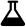

.. _regisdemo:

Re-GIS Demo
===========
These instructions presume that you have Re-GIS installed and running on your system. See the `installation section <installation.html>`_ if you need information about installing and running Re-GIS

When the Re-GIS server has been started with ``docker-compose up --build`` , you can access Re_GIS via a web browser at the address http://localhost:8008 .

Select a layer
--------------
Re-GIS will display a map and offer you the opportunity to put a transparent layer with data on the map. To select a layer:

1) click on the three horizontal lines, top left of the page
2) click on the three sheets of paper in the new menu, second from the left
3) select the Fire Paths layer in the new drop down menu
4) move the map to the south of the country of India: left click, hold and drag to move the map left/right/up/down and use the mouse wheel to zoom in and out
5) you will find a blue path in the city of Bangalore

Create a new layer
------------------
To create a new layer:

1) click on the three horizontal lines, top left of the page
2) click on the |Erlenmeyer bottle| logo (fourth from left)

3) click on the |pencil|

4) drag the pin to an area on the map
5) click on Show Simulation Form
6) press Submit in the new window
7) on the left, click on the top blue eye
8) click on the three slides of paper
9) select the test.geojson item at the bottom

You will see a data layer with the pin logo with a yellow circle around it at the position selected by you. You can repeat these actions to select more positions with or without surrounding circles of various sizes.
